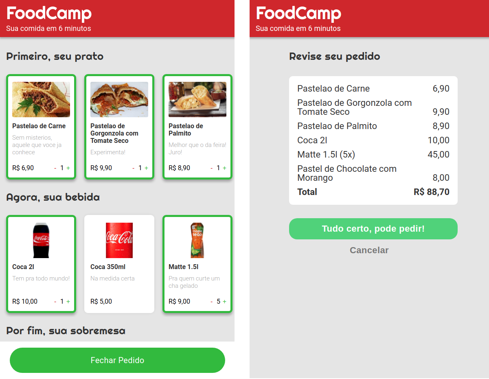

# Foodcamp

React-Foodcamp is a single page application in which the user can choose at least one and up to any number of items per category for any number of categories. Once the order is ready to be placed and the 'Fechar pedido' button is clicked, the user is routed to the checkout review screen for reviewing, where they can cancel it or confirm the order and send it through whatsapp using the whatsapp API. The scrollbars that show up in the large screen sizes were a requirement set by others for this project but they can be easily hidden.

## Built With

- React , JavaScript , CSS3 , HTML5  
- Windows, Linux

## Live Demo

[Live Demo Link](https://react-foodcamp-pzhu66hvf-vitorelourenco.vercel.app/)

## Instalation

- git clone https://github.com/vitorelourenco/react-foodcamp.git
- npm install

## Preview

run the command:
- npm start

## Build

run the command:
- npm run build

## Deploy

You can deploy this project on Vercel but beforehand you may need to run:
- npm install react-router-dom

## Authors

👤 **Vitor Emanuel Lourenco**

- GitHub: [@vitorelourenco](https://github.com/vitorelourenco)
- Twitter: [@Vitorel](https://twitter.com/Vitorel)
- LinkedIn: [vitoremanuellourenco](https://www.linkedin.com/in/vitoremanuellourenco/)

## 🤝 Contributing

Contributions, issues, and feature requests are welcome!

Feel free to check the [issues page](https://github.com/vitorelourenco/react-foodcamp/issues).

## Show your support

Give a ⭐️ if you like this project!

## Acknowledgments

- RespondeAi (https://www.respondeai.com.br/)
- The Odin Project (https://www.theodinproject.com/)
